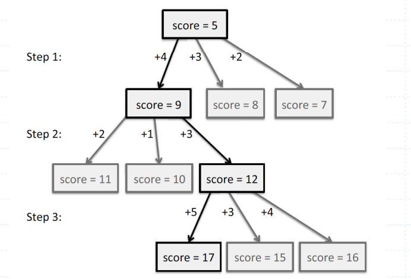

# Introduction

The Greedy Method The greedy method is a general algorithm design paradigm, built on the following elements:

* configurations: different choices, collections, or values to find&#x20;
* objective function: a score assigned to configurations, which we want to either maximize or minimize&#x20;

It works best when applied to problems with the greedy-choice property:&#x20;

* A globally-optimal solution can always be found by a series of local improvements from a starting configuration.
* The sequence of choices starts from some well-understood starting configuration, and then iteratively makes the decision that is best from all of those that are currently possible, in terms of improving the objective function.

